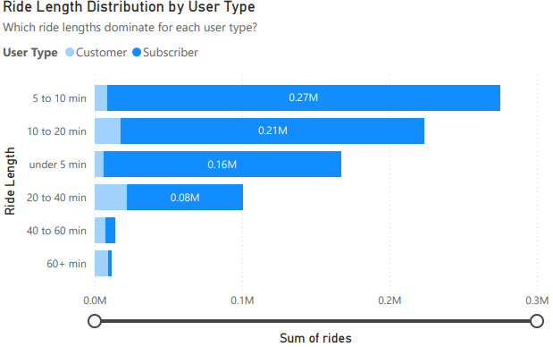

# Cyclistic Bike Share Case Study

## Overview
This project analyzes historical bike trip data for Cyclistic, a bike share company, to understand how casual riders and annual members use bikes differently. The goal of this analysis is to identify behavioral patterns that can inform strategies to convert casual riders into annual members.

The analysis follows a full data analytics workflow including data cleaning, SQL analysis, and dashboard development in Power BI.

---

## Business Task
Cyclistic’s marketing team wants to maximize the number of annual memberships.

Key questions include:
• How do annual members and casual riders use Cyclistic bikes differently?
• Why would casual riders purchase an annual membership?
• How can Cyclistic use digital media to influence casual riders to become members?

---

## Stakeholders
• Lily Moreno, Director of Marketing  
• Cyclistic Marketing Analytics Team  
• Cyclistic Executive Leadership  

---

## Data Sources
Public bike trip data provided by Cyclistic and Divvy.

Data sources:

• [Cyclistic Ride Trip Data 2019 Q1](https://docs.google.com/spreadsheets/d/1winAdsMgjizcwRZF0vy5VHZv9Asw52x4daojS48MsMM/edit?gid=640449855#gid=640449855)

• [Cyclistic Ride Trip Data 2020 Q1](https://docs.google.com/spreadsheets/d/1awxji14ish6Nez8q2vTYvLoW3giU9EacpI2fB7oxFAQ/edit?gid=1797029090#gid=1797029090)

Data covers multiple months of ride history and includes ride timing, duration, user type, and station information.

---

## Data Cleaning and Preparation
The following steps were taken to ensure data accuracy, consistency, and privacy:

• Saved original raw files before making changes  
• Verified column consistency across monthly datasets  
• Standardized user type values (subscriber vs customer)  
• Removed personal and sensitive fields such as birth year and gender  
• Removed unused columns including station IDs, coordinates, and rideable type  
• Renamed columns for consistency (ride_id to trip_id)  
• Recalculated ride duration to ensure consistency  
• Converted date and time fields to proper formats  
• Removed invalid rides with negative duration or duration greater than 24 hours  
• Added columns to include weekday/ weekend
• Merged monthly datasets into a single cleaned file  

Cleaned File (With Pivot Tables): 

• [Cyclistic_2019_2020_Cleaned](https://docs.google.com/spreadsheets/d/1TSul1ksvHAXaogqjXtFZ5MPEoyNczS6uFo51ncu_AEQ/edit?gid=1797029090#gid=1797029090)

---

## Key Problems and Solutions

### Issue: Ride duration calculations returned incorrect values
Solution:
Date and time fields were reformatted properly and ride duration was recalculated using consistent datetime logic.

### Issue: Spreadsheet crashes during merge
Solution:
Data was pasted in chunks and column counts were validated to ensure full merges without data loss.

### Issue: BigQuery schema errors during upload
Solution:
Auto schema detection was disabled and field types were manually defined. A new table was created with correct data types instead of strings.

### Issue: Start and end time fields returned null values
Solution:
Datetime fields were explicitly cast and validated before loading into analysis tables.

---

## Analysis and Key Findings

### Who rides
Subscribers account for over 90 percent of total rides, indicating significantly higher overall engagement.

### When they ride
Subscribers show strong weekday morning and evening usage, consistent with commuting patterns. Customer usage increases on weekends and during warmer months.

### How long they ride
Customers consistently take longer rides, while subscribers favor shorter, more frequent trips.

### Why they ride
Customers are far more likely to take round-trips, suggesting recreational usage rather than commuting.

## Pivot Tables

Before building the SQL queries and Power BI dashboard, exploratory analysis was conducted using pivot tables in Google Sheets to validate trends and uncover behavioral patterns.

These pivot tables helped guide deeper analysis and ensured insights were data driven before visualization.

Here are the full pivot tables for reference/ editing: 

[Cyclistic_data_and_pivot_tables](https://docs.google.com/spreadsheets/d/1TSul1ksvHAXaogqjXtFZ5MPEoyNczS6uFo51ncu_AEQ/edit?gid=1797029090#gid=1797029090)

### Key Exploratory Insights

#### Top Start Stations by User Type
Pivot tables were used to identify the most popular start stations for customers, subscribers, and overall riders.

This revealed that:
• Subscribers tend to start rides near downtown and business districts  
• Customers frequently start rides near parks, waterfronts, and tourist areas  

This insight supports station based marketing and localized promotions targeting high traffic customer locations.

---

#### Ride Length Comparison
Average ride length pivot tables showed a clear behavioral difference:
• Customers consistently take longer rides  
• Subscribers favor shorter, repeat trips  

This confirmed the hypothesis that customers use bikes recreationally while subscribers use them for commuting.

---

#### Weekday vs Weekend Usage
Pivot tables comparing weekday and weekend usage showed:
• Subscribers ride primarily on weekdays  
• Customers ride disproportionately more on weekends  

This insight supports targeting casual riders with weekend focused campaigns and membership offers.

---

#### Start Time Patterns
Hourly start time pivots revealed:
• Subscriber rides peak during weekday morning and evening rush hours  
• Customer rides peak midday and afternoons  

This helped inform digital advertising timing and messaging strategies.

---

## Visualizations and Dashboard
All analysis results are presented in an interactive Power BI dashboard.

Dashboard includes:
• Subscriber vs. Customer Overview
• Monthly Usage Trends
• Ride Behavior and Trip Length
• Behavioral Usage: Leisure vs. Commuting

Power BI Visualization files:

• [Power BI](https://github.com/ethanj360/cyclistic_bikes_case_study/blob/main/Power%20BI%20Files/Cyclistic%20Case%20Study%20Visualizations%20(Final).pbix)

• [PDF](https://github.com/ethanj360/cyclistic_bikes_case_study/blob/main/Power%20BI%20Files/Cyclistic%20Case%20Study%20Visualizations%20(Final).pdf)

---

## Recommendations
1. Target high usage casual riders during weekends and peak seasons with membership promotions. Can also target during non-commuting/rush weekday hours.
2. Promote annual memberships as cost-effective options for frequent leisure riders.
3. Use digital ads timed around weekends and warmer months when customer activity peaks.
4. Target high-traffic customer stations for marketing purposes. 

---

## What I Learned
This project strengthened my ability to work with large datasets, resolve data quality issues, and translate behavioral patterns into business recommendations. I gained hands on experience with SQL, Power BI, and real world data cleaning challenges while practicing stakeholder focused analysis.

---

## Tools Used
• SQL (Google BigQuery)
• Google Sheets
• Power BI
• Excel

